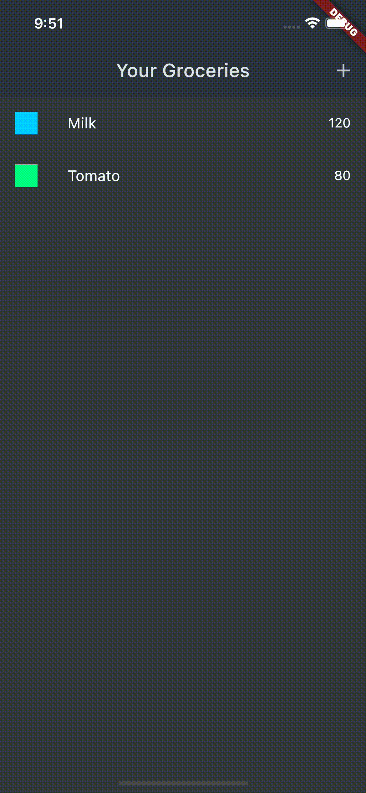

# Shopping List App

Handling User Input With Forms

A Closer Look At Handling User Input
- Building & Using Forms
- Showing On-Screen Validation Errors
- Form Submission & Resetting

Connecting a Backend

Sending HTTP Requests From The App To A Backend
- Why Would You Add A Backend?
- Sending HTTP Requests From Flutter Apps To Backends

Section11, 12 : [Flutter & Dart - The Complete Guide：2023 Edition](https://www.udemy.com/course/learn-flutter-dart-to-build-ios-android-apps/)

## Demo

